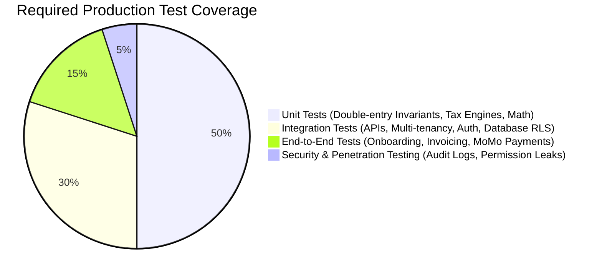
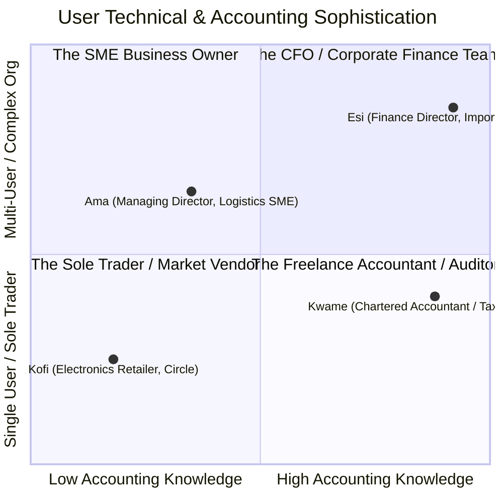
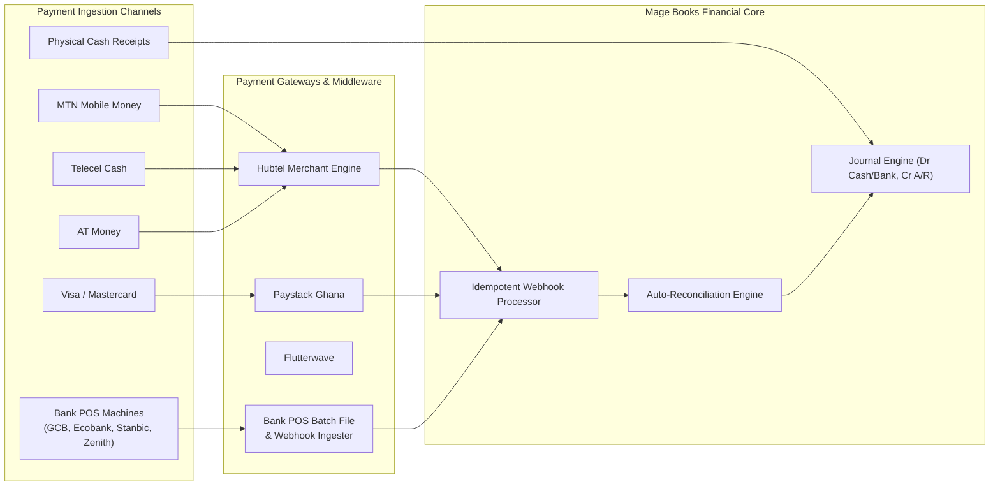
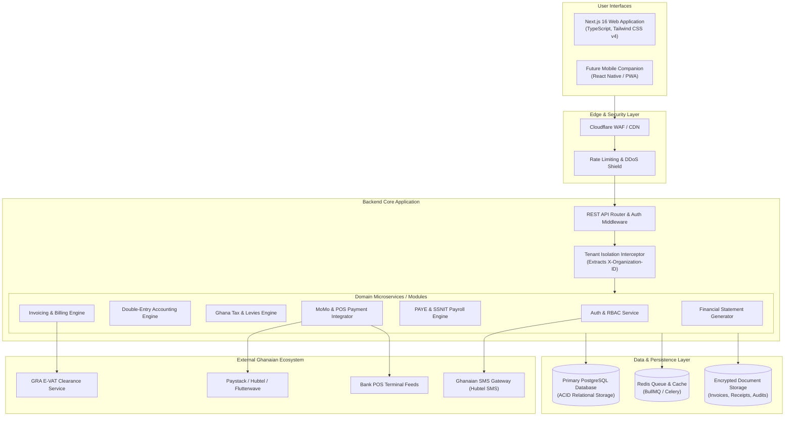
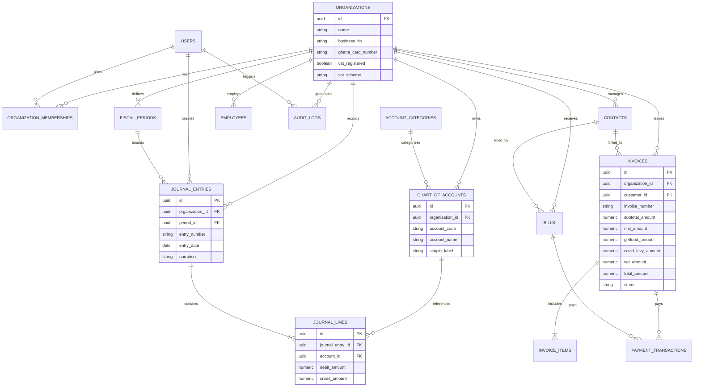
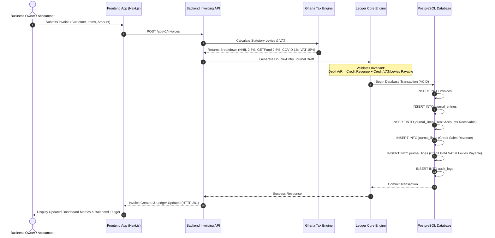
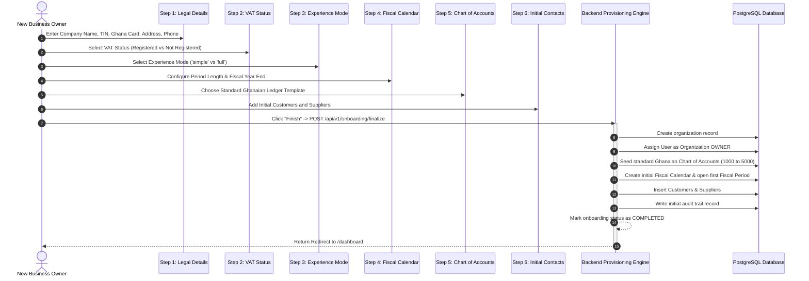
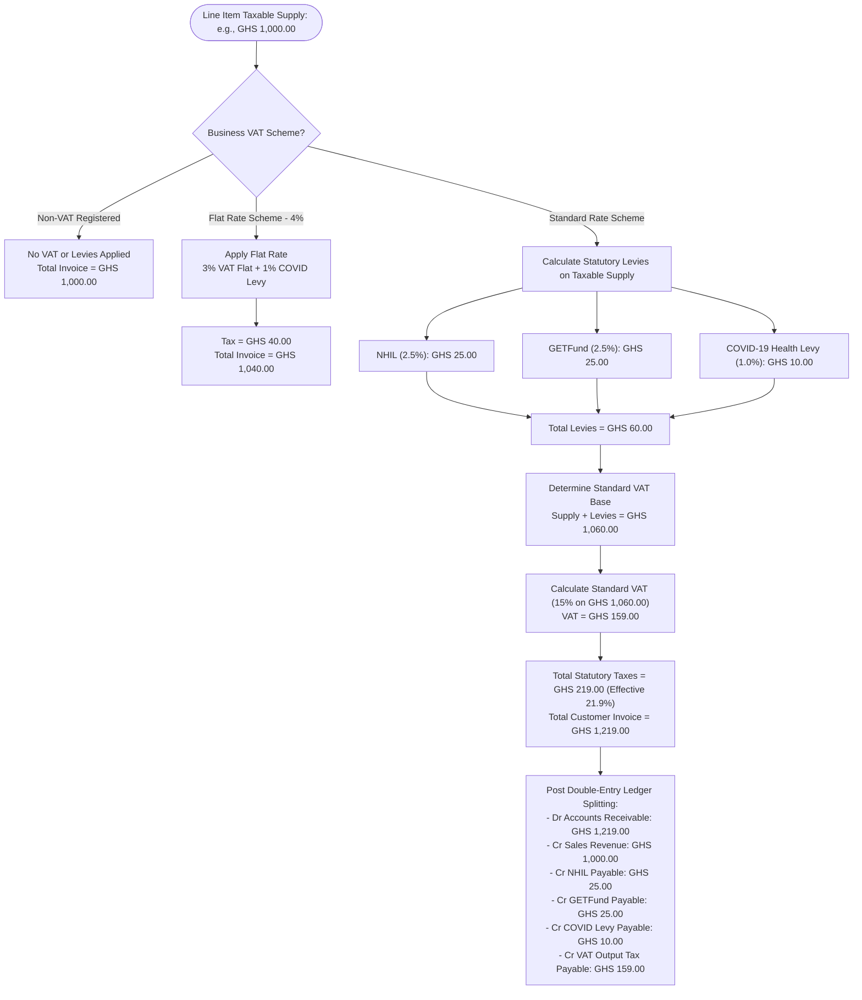

# Mage Books SAAS — Comprehensive Engineering Specification & Architecture Manual

> **A Complete Technical Blueprint Covering Project History, Statutory Compliance, Testing Audit, Dual-Mode Design, and Full-Scale Backend Implementation.**

---

# Table of Contents
1. [Part 1: Project History & Current State ("What Has Happened")](#part-1-project-history--current-state-what-has-happened)
   - 1.1 Git Commit Chronology & Milestones
   - 1.2 Design Origin & Figma MCP Asset Ingestion
   - 1.3 Comprehensive Component & Page Implementation Audit
   - 1.4 Client-Side State Architecture & Mode Context
2. [Part 2: Testing & Quality Assurance Audit ("What Tests Have Been Run")](#part-2-testing--quality-assurance-audit-what-tests-have-been-run)
   - 2.1 Current Testing State
   - 2.2 Environment & Build Audit
   - 2.3 Visual & Manual Verifications Conducted
   - 2.4 Production Quality Assurance & Testing Roadmap
3. [Part 3: Target of the Project & Product Strategy](#part-3-target-of-the-project--product-strategy)
   - 3.1 Business Vision & Target User Personas
   - 3.2 Ghanaian Statutory & Regulatory Compliance Engine
   - 3.3 The Dual-Experience Mode UX Paradigm
4. [Part 4: Complete Backend Engineering Blueprint ("What Will Be Needed")](#part-4-complete-backend-engineering-blueprint-what-will-be-needed)
   - 4.1 Backend Architecture Comparison: Node.js/NestJS vs. Next.js vs. Python/Django
   - 4.2 Multi-Tenant Isolation & Role-Based Access Control (RBAC)
   - 4.3 Database Schema & Relational Data Models (PostgreSQL DDL)
   - 4.4 Financial Engine Invariants & Immutable Ledger Rules
   - 4.5 Complete RESTful API Endpoint Catalog
   - 4.6 Payment Rails & Banking POS Integration Architecture
   - 4.7 GRA E-VAT Clearance Integration
   - 4.8 Misuse Case Threat Modeling & Automated CI/CD Security Architecture
5. [Part 5: Architectural & Workflow Diagrams](#part-5-architectural--workflow-diagrams)
   - 5.1 System Architecture Diagram
   - 5.2 Multi-Tenant Entity-Relationship Diagram (ERD)
   - 5.3 Double-Entry Financial Transaction Flow
   - 5.4 6-Step Onboarding & Provisioning Sequence
   - 5.5 Ghanaian Statutory Tax Engine Flow

---

# Part 1: Project History & Current State ("What Has Happened")

## 1.1 Git Commit Chronology & Milestones

The repository history reflects an organized, modular development lifecycle executed primarily by developer `iyaddeen23 <iyaddeen1@gmail.com>` between August 10, 2026 and August 15, 2026 across feature branches (`feat/dashboard`, `develop`, `main`):

```
edb65da - Merge pull request #3 from iyaddeen23/develop
623a0a6 - Merge pull request #2 from iyaddeen23/feat/dashboard
7c1c921 - feat/complete dashboard screens
1d138b8 - Merge pull request #1 from iyaddeen23/develop
41897a7 - feat/ loading screen
f267eee - feat/ auth and project initialization
```

### Commit Milestones Breakdown:
1. **`f267eee` (August 10, 2026) — `feat/ auth and project initialization`**:
   - Initialized Next.js project with App Router, TypeScript, and Tailwind CSS v4.
   - Built branded root layout, global CSS color token variables, and reusable `Logo` component.
   - Built standalone authentication screens: `/login` (supporting email/phone and password toggle) and `/signup` (with confirm password and redirect to onboarding).
2. **`41897a7` (August 10, 2026) — `feat/ loading screen`**:
   - Implemented high-fidelity splash screen at route `/`.
   - Displays Mage Books brandmark, tagline (*"BUILT FOR GHANAIAN BUSINESSES"*), CSS animated progress bar, and automated 2.8-second client redirect to `/login`.
3. **`1d138b8` (August 10, 2026) — `Merge pull request #1 from iyaddeen23/develop`**:
   - Merged initial auth and loading screen milestones into `main`.
4. **`7c1c921` (August 15, 2026) — `feat/complete dashboard screens`**:
   - Implemented the complete 6-Step Onboarding Wizard under `(onboarding)/onboarding`:
     * Step 1: Legal Company Details (Ghana TIN, Ghana Card, Address, Phone, Email).
     * Step 2: VAT Status (GRA registration toggle and GHS 200,000 threshold guidance).
     * Step 3: Choose Experience Mode (Simple vs. Professional).
     * Step 4: Fiscal Calendar Setup (Period length and interactive fiscal year-end picker).
     * Step 5: Chart of Accounts (Ghanaian Standard template vs. Custom CSV/Excel upload).
     * Step 6: Initial Customer & Supplier capture.
   - Introduced `ModeContext.tsx` to persist user experience mode across sessions via `localStorage`.
   - Created `(dashboard)/layout.tsx` featuring persistent `SideNavBar` (with 18 dynamic links toggling between simple and professional terms) and `TopNavBar` (company title, search, all-clear badge, notifications, and profile).
   - Built full Main Dashboard page (`/dashboard`) with financial metric cards, recent activity stream, cash snapshot bar chart, and help center card.
   - Built interactive Chart of Accounts page (`/dashboard/chart-of-accounts`) displaying dual-mode account structures.
   - Created routing shells and empty states for the remaining 16 dashboard feature pages.
5. **`623a0a6` & `edb65da` (August 15, 2026)**:
   - Merged dashboard feature branch into develop and subsequently into `main`.

---

## 1.2 Design Origin & Figma MCP Asset Ingestion

Inspection of `.claude/settings.local.json` reveals the UI design origin. The interface was converted from professional Figma design mockups using the Figma MCP (Model Context Protocol) plugin:
- Design context and metadata were pulled directly from Figma nodes.
- 69 optimized SVG and PNG assets were fetched and stored into `public/assets/`.
- Color palettes, typography, card borders (`#c3c6d7`), background shades (`#f4f7fe`, `#f9f9ff`), and iconography reflect a tailored fintech aesthetic.

---

## 1.3 Comprehensive Component & Page Implementation Audit

The codebase currently contains **22 page routes and components**. The table below details their exact operational status, lines of code, and completion level:

| File Path | Route | Lines | Current Status | Detailed Description |
| :--- | :--- | :---: | :--- | :--- |
| `src/app/page.tsx` | `/` | 82 | **Complete (Client)** | Splash screen with animated loading bar and 2.8s redirect to `/login`. |
| `src/app/(auth)/login/page.tsx` | `/login` | 119 | **UI Complete (Mock)** | Login form with password visibility toggle. Form action has `// TODO: wire up auth logic`. |
| `src/app/(auth)/signup/page.tsx` | `/signup` | 144 | **UI Complete (Mock)** | Registration form with confirm password. Submits via `router.push('/onboarding')`. |
| `src/app/(onboarding)/onboarding/page.tsx` | `/onboarding` | 162 | **Functional Wizard** | Manages 6-step state machine, progress bar calculation, back/next navigation, and finish redirect. |
| `src/components/onboarding/Step1CompanyDetails.tsx` | Component | 117 | **Functional UI** | Captures company name, business TIN, Ghana Card ID, address, phone (+233), and email. |
| `src/components/onboarding/Step2VATStatus.tsx` | Component | 86 | **Functional UI** | Radio selection for GRA VAT registration status with Ghanaian tax threshold info box. |
| `src/components/onboarding/Step3ChooseExperience.tsx` | Component | 90 | **Functional UI** | Card selection between "Keep it simple" and "I know accounting". |
| `src/components/onboarding/Step4FiscalCalendar.tsx` | Component | 185 | **Functional UI** | Interactive calendar grid picker for fiscal year-end and monthly/quarterly/annual toggles. |
| `src/components/onboarding/Step5ChartOfAccounts.tsx` | Component | 124 | **Functional UI** | Standard Ghanaian ledger category preview vs. drag-and-drop CSV/XLSX file upload placeholder. |
| `src/components/onboarding/Step6Contacts.tsx` | Component | 158 | **Functional UI** | Dynamic list manager allowing adding/removing customers and suppliers with TIN inputs. |
| `src/contexts/ModeContext.tsx` | Context | 40 | **Operational** | React Context managing `"simple"` vs `"full"` mode, persisting to `localStorage.getItem("mage-mode")`. |
| `src/components/dashboard/SideNavBar.tsx` | Component | 151 | **Operational** | 18 dynamic links changing label and icons based on active `mode`. Includes mode toggle switch and logout. |
| `src/components/dashboard/TopNavBar.tsx` | Component | 47 | **Operational** | Header with company label, search input, notification badge, and avatar. |
| `src/app/(dashboard)/layout.tsx` | Dashboard Shell | 18 | **Operational** | Wraps all `/dashboard/*` routes in `ModeProvider` with persistent side and top bars. |
| `src/app/(dashboard)/dashboard/page.tsx` | `/dashboard` | 247 | **UI Complete (Mock)** | Metric KPI cards, recent activity stream, cash snapshot CSS bar chart, and help center card. |
| `src/app/(dashboard)/dashboard/chart-of-accounts/page.tsx` | `/dashboard/chart-of-accounts` | 197 | **UI Complete (Mock)** | Dual-mode account views: simple categories vs. formal assets, liabilities, equity, and income. |
| `src/app/(dashboard)/dashboard/accounts-payable/page.tsx` | `/dashboard/accounts-payable` | 58 | **Partial Shell** | Summary KPI cards (Total Payable, Overdue, Due This Month), empty state, and "+ Record Bill" button. |
| `src/app/(dashboard)/dashboard/accounts-receivable/page.tsx` | `/dashboard/accounts-receivable` | 58 | **Partial Shell** | Summary KPI cards (Total Receivable, Overdue, Due This Month), empty state, and "+ New Invoice" button. |
| `src/app/(dashboard)/dashboard/audit/page.tsx` | `/dashboard/audit` | 54 | **Partial Shell** | Activity log view with mock entries (user action, timestamp) and empty state. |
| `src/app/(dashboard)/dashboard/hire-expert/page.tsx` | `/dashboard/hire-expert` | 47 | **Functional Cards** | Directory cards for Ghanaian expert services (Tax Filing, Bookkeeping, Audit, Payroll, Advisory, VAT). |
| `src/app/(dashboard)/dashboard/reports/page.tsx` | `/dashboard/reports` | 45 | **Functional Cards** | Report selector cards (Business Overview, P&L, Balance Sheet, Cash Flow, Tax Summary, Aged Receivables). |
| `src/app/(dashboard)/dashboard/fixed-assets/page.tsx` | `/dashboard/fixed-assets` | 49 | **UI Shell** | Header, mode-sensitive title ("Equipment & Property" vs "Fixed Asset Register"), and empty state. |
| `src/app/(dashboard)/dashboard/period-rectification/page.tsx` | `/dashboard/period-rectification` | 48 | **UI Shell** | Warning banner on closed period impacts, mode-sensitive titles, and empty state. |
| `src/app/(dashboard)/dashboard/transactions/page.tsx` | `/dashboard/transactions` | 39 | **UI Shell** | Page header, mode-sensitive CTA ("Record Transaction" vs "New Journal Entry"), empty state. |
| `src/app/(dashboard)/dashboard/payroll/page.tsx` | `/dashboard/payroll` | 39 | **UI Shell** | Mode-sensitive title ("Staff Pay" vs "Payroll"), action button, and empty state. |
| `src/app/(dashboard)/dashboard/setup/page.tsx` | `/dashboard/setup` | 37 | **Functional Cards** | Configuration cards: Company Profile, Tax Settings, Currency & Locale, Integrations, Emails, Alerts. |
| `src/app/(dashboard)/dashboard/security/page.tsx` | `/dashboard/security` | 37 | **UI Shell** | Security log list with mock IP, browser agent, and event type. |
| `src/app/(dashboard)/dashboard/ledgers/page.tsx` | `/dashboard/ledgers` | 31 | **UI Shell** | General ledger account viewer placeholder. |
| `src/app/(dashboard)/dashboard/receipts/page.tsx` | `/dashboard/receipts` | 31 | **UI Shell** | Receipt management and upload placeholder. |
| `src/app/(dashboard)/dashboard/payments/page.tsx` | `/dashboard/payments` | 31 | **UI Shell** | Outgoing disbursement record placeholder. |
| `src/app/(dashboard)/dashboard/contacts/page.tsx` | `/dashboard/contacts` | 31 | **UI Shell** | Customers and suppliers directory placeholder. |
| `src/app/(dashboard)/dashboard/inventory/page.tsx` | `/dashboard/inventory` | 31 | **UI Shell** | Stock levels and product catalog placeholder. |
| `src/app/(dashboard)/dashboard/users/page.tsx` | `/dashboard/users` | 31 | **UI Shell** | Team members and permission management placeholder. |

---

## 1.4 Client-Side State Architecture & Mode Context

The frontend application uses React Context to control the dual experience:
```typescript
export type AppMode = "simple" | "full";

interface ModeContextValue {
  mode: AppMode;
  setMode: (m: AppMode) => void;
}
```
- When the user selects "simple" or "full", `ModeProvider` stores the value in `localStorage` under the key `"mage-mode"`.
- `SideNavBar.tsx` and individual dashboard pages subscribe via the custom hook `useMode()`.
- **Limitation of current state**: Mode preference is purely browser-local and not synchronized with a backend user profile. In production, this must be persisted in the user's database settings table.

---

# Part 2: Testing & Quality Assurance Audit ("What Tests Have Been Run")

## 2.1 Current Testing State

An exhaustive audit of the codebase confirms:
- **Zero Automated Test Suites**: There are no unit tests, integration tests, or end-to-end (E2E) tests present in the repository. No test files matching `*.test.*`, `*.spec.*`, or `__tests__` exist.
- **No Test Framework Installed**: `package.json` does not include Jest, Vitest, Playwright, Cypress, or React Testing Library.
- **Missing NPM Scripts**: The only configured scripts are `"dev"`, `"build"`, `"start"`, and `"lint"`.

## 2.2 Environment & Build Audit

- **`node_modules` Status**: The `node_modules` folder is **not installed** in the workspace root (`Test-Path node_modules` evaluates to `False`).
- **ESLint Status**: Attempting to run `npm run lint` yields:
  ```
  'eslint' is not recognized as an internal or external command, operable program or batch file.
  ```
  This indicates that dependencies must be installed with `npm install` before linters or compilers can execute.
- **Static Typings**: TypeScript types are defined across all components (`interface Step1Data`, `interface Contact`, `type PeriodLength`, `type COAPath`). However, compiler verification (`tsc --noEmit`) requires package resolution.

## 2.3 Visual & Manual Verifications Conducted

The developer performed visual and manual verification during feature development:
1. **Viewport & Responsive Layout**: Stepper bars, sidebars, and cards use flexbox/grid configurations that align cleanly on standard desktop displays (min-width: 1024px).
2. **Interactive State Machines**:
   - The 6-step onboarding wizard validates navigation forward and backward.
   - StepperBar accurately calculates progress bar widths:
     `const PROGRESS_WIDTHS = ["4.7%", "19.2%", "37.4%", "55.7%", "75.2%", "89.8%"]`.
   - Date picker in Step 4 accurately computes month boundaries and days of the week.
   - Dynamic contact addition/removal functions properly in local memory.
3. **Mode Toggling**: Switching between "Simple" and "Accounting" on the sidebar immediately updates the navigation labels and page copy without triggering page reloads.

## 2.4 Production Quality Assurance & Testing Roadmap

Before taking Mage Books to production, the following test pyramid must be implemented:



### Essential Test Suites Required:
1. **Double-Entry Financial Math Unit Tests**:
   - Invariant: For every transaction, $\sum \text{Debits} - \sum \text{Credits} = 0$.
   - Floating-point prevention: All currency calculations must use integer cents/pesewas or arbitrary-precision decimals (`Decimal.js` or database `NUMERIC(18,4)`), never raw JavaScript floats.
2. **Ghanaian Statutory Tax Calculation Tests**:
   - Verify compound tax computations: Standard VAT (15%) calculated on top of levies (NHIL 2.5% + GETFund 2.5% + COVID-19 1%).
   - Verify Withholding Tax (WHT) deductions on vendor bill disbursements.
   - Verify GRA PAYE progressive income tax brackets and SSNIT deductions.
3. **Multi-Tenant Security Tests**:
   - Tenant isolation validation: Ensure User A of Organization 1 can never view or query transactions of Organization 2 under any circumstance.
4. **E2E Browser Automation (Playwright)**:
   - Full flow: Sign up $\rightarrow$ complete 6-step onboarding $\rightarrow$ issue customer invoice $\rightarrow$ record payment $\rightarrow$ check P&L report.

---

# Part 3: Target of the Project & Product Strategy

## 3.1 Business Vision & Target User Personas

Mage Books aims to become the standard cloud accounting and tax engine for the Ghanaian formal and informal business ecosystem, currently estimated at over 2 million MSMEs.

### Primary User Personas:



1. **The Sole Trader / Retailer (e.g., Kofi)**:
   - *Profile*: Operates an electronics shop in Accra. Accepts Mobile Money and cash.
   - *Needs*: Simple invoicing, knowing who owes him money, recording daily expenses.
   - *Preferred Mode*: **Simple Mode**. Does not understand debits or chart of accounts.
2. **The SME Managing Director (e.g., Ama)**:
   - *Profile*: Runs a logistics company with 12 employees. VAT registered with GRA.
   - *Needs*: Filing monthly GRA VAT returns, running payroll with PAYE/SSNIT, bank reconciliation.
   - *Preferred Mode*: **Simple Mode** for day-to-day operations, delegating **Professional Mode** to her accountant.
3. **The External Accountant & Tax Consultant (e.g., Kwame)**:
   - *Profile*: Chartered accountant managing 15 SME clients simultaneously.
   - *Needs*: Multi-client switching, manual journal entries, adjusting prior periods, trial balance generation, and audit logging.
   - *Preferred Mode*: **Professional Mode**. Utilizes the "Hire An Expert" portal to acquire new SME clients.

---

## 3.2 Ghanaian Statutory & Regulatory Compliance Engine

Mage Books derives its competitive advantage from deep, native compliance with the Ghana Revenue Authority (GRA) and Republic of Ghana business regulations.

### 1. National Identification & Tax Identifiers:
- **Ghana Card**: The primary legal identity document for citizens and residents. Format: `GHA-XXXXXXXXX-X` (where X is a digit). Required for all business directors.
- **Business TIN (Taxpayer Identification Number)**: Mandatory identifier issued by the GRA. Format: 11 characters prefixed by letter `C` (Company) or `P` (Individual/Sole Trader), e.g., `C0001234567`.

### 2. The Ghanaian Value Added Tax (VAT) System:
- **Registration Threshold**: Mandatory for businesses making taxable supplies exceeding **GHS 200,000** over a 12-month period, or **GHS 50,000** over 3 months.
- **VAT Schemes**:
  * **Standard Rate Scheme (Effective Rate: ~21.9%)**:
    1. National Health Insurance Levy (NHIL): **2.5%** on taxable supply.
    2. Ghana Education Trust Fund (GETFund): **2.5%** on taxable supply.
    3. COVID-19 Health Recovery Levy: **1.0%** on taxable supply.
    4. Value Added Tax (VAT): **15.0%** charged on `(Taxable Supply + NHIL + GETFund + COVID-19 Levy)`.
  * **VAT Flat Rate Scheme (VFRS)**:
    - Applicable to retail traders and wholesalers of goods: **3% VAT + 1% COVID-19 Levy = 4% flat** on the gross value of goods sold (no input tax deduction).

### 3. Withholding Tax (WHT):
- Standard Ghanaian rates applied on supplier disbursements:
  * Supply of Goods: **3%**
  * Supply of Services: **5%** (to resident entities) or **20%** (to non-residents).
  * Rent on Commercial Property: **15%**; Residential: **8%**.

### 4. Payroll Deductions (GRA PAYE & SSNIT):
- **SSNIT (Social Security and National Insurance Trust)**:
  * Tier 1 (First Tier Basic Social Security): **13.5%** employer contribution.
  * Tier 2 (Second Tier Mandatory Occupational Pension): **5.0%** employee deduction.
- **PAYE (Pay-As-You-Earn)**: Progressive monthly income tax brackets defined by GRA (graduating from 0% up to 35% for high earners).

---

## 3.3 The Dual-Experience Mode UX Paradigm

Mage Books solves the core usability friction of accounting software by implementing dynamic terminology and abstraction layers:

| Business Function | Simple Mode ("Keep it simple") | Professional Mode ("I know accounting") |
| :--- | :--- | :--- |
| **Sales & Credit** | "Money Owed to Me" | Accounts Receivable (A/R) & Aging Ledger |
| **Supplier Bills** | "Money I Owe" | Accounts Payable (A/P) & Voucher Processing |
| **Asset Tracking** | "What I Own" / "Equipment & Property" | Fixed Asset Register & Depreciation Schedules |
| **Equity & Capital** | "My Share" | Owner's Equity, Capital Accounts & Retained Earnings |
| **Revenue & Costs** | "Money Made" / "Money Spent" | Chart of Accounts (4000 Revenue, 5000 Expenses) |
| **Employee Wages** | "Staff Pay" | Payroll Engine (Gross, Net, PAYE, Tier 1/2 SSNIT) |
| **Book Adjustments** | "Fix a Past Mistake" | Prior Period Rectification & Adjusting Journal Entries |
| **Transaction Logs** | "Activity Log" | Forensic Audit Trail & General Ledger Audit |
| **Ledger Postings** | *Hidden (Automated in background)* | Double-Entry Manual Journal Entry Screen |

---

# Part 4: Complete Backend Engineering Blueprint ("What Will Be Needed")

## 4.1 Backend Architecture Comparison: Node.js/NestJS vs. Next.js vs. Python/Django

Choosing the right backend foundation is critical for a multi-tenant financial platform. Here is a direct side-by-side comparison of the three primary architectural candidates:

| Architectural Metric | Next.js Server Actions / Route Handlers | Node.js + NestJS (Modular TypeScript) | Python + Django + Django REST Framework (DRF) |
| :--- | :--- | :--- | :--- |
| **Architecture Type** | Monolithic Full-Stack Serverless/Node | Decoupled Microservices / Modular Monolith | Decoupled Full-Featured MVC / REST Framework |
| **Transaction ACID Guarantees** | Moderate (relies on ORM transactions in Server Actions) | **High** (Native support for Unit-of-Work & SQL transactions) | **Very High** (`django.db.transaction.atomic` is battle-tested in banking) |
| **Internal Admin Backoffice** | Must be coded completely from scratch | Must be coded from scratch (or use third-party admin tools) | **Built-in Superpower** (Instant, secure, customizable Django Admin for auditing & support) |
| **Accounting Math & Precision** | Good (using `Decimal.js` or BigInt) | Good (using `Decimal.js` / TypeScript type guards) | **Exceptional** (Python's native `decimal.Decimal` module is industry benchmark) |
| **ORM & Database Tooling** | Prisma or Drizzle ORM | Prisma, TypeORM, or MikroORM | **Django ORM** (Unrivaled migration engine, signals, robust query optimization) |
| **Multi-Tenancy Support** | Manual tenant filtering in every query | Middleware / Interceptors with AsyncLocalStorage | `django-tenants` (PostgreSQL schemas) or row-level tenant managers |
| **Background Jobs & Queues** | Requires external queue (Inngest, Trigger.dev, Upstash) | BullMQ + Redis integration | Celery + Redis (Industry standard for heavy PDF, tax, and batch jobs) |
| **Security & Authentication** | Auth.js / Supabase / Clerk | Passport.js, JWT, guards, role decorators | Built-in authentication, password hashing (PBKDF2/Argon2), CSRF protection |
| **Code Sharing with Frontend** | 100% (Shared TypeScript types and interfaces) | 80% (Shared TypeScript types via Monorepo / npm package) | 0% (Types generated via OpenAPI/Swagger schemas) |

### Engineering Recommendation:
1. **Option A: Python + Django REST Framework (Recommended for Accounting Rigor & Backoffice)**:
   - *Why*: In financial SaaS, 30% of engineering time is spent building internal administration tools to fix ledger anomalies, manage tenants, inspect failed payments, and audit entries. Django provides this out of the box. Python's `decimal` library eliminates floating-point bugs, and Celery handles heavy batch payroll and GRA clearance jobs effortlessly.
2. **Option B: Node.js + NestJS + PostgreSQL (Recommended for Pure TypeScript Stack)**:
   - *Why*: Enables a unified TypeScript monorepo across frontend and backend. NestJS brings enterprise-grade dependency injection, modular domain design, and standard OpenAPI documentation generation.

---

## 4.2 Multi-Tenant Isolation & Role-Based Access Control (RBAC)

Financial security demands absolute isolation between organizations:
- **Tenant Isolation Pattern**: Shared Database with Row-Level Tenant Isolation (`organization_id` foreign key on every table) or PostgreSQL Row-Level Security (RLS) policies.
- **RBAC Roles Hierarchy**:
  1. `OWNER`: Full administrative, fiscal, and destructive rights (billing, organization deletion).
  2. `ADMIN`: Manages team members, integrations, settings, and full accounting.
  3. `ACCOUNTANT`: Creates/approves journal entries, executes payroll, rectifies prior periods, generates financial statements.
  4. `BOOKKEEPER`: Records daily transactions, enters invoices and bills; cannot close periods or modify chart of accounts.
  5. `AUDITOR`: Read-only access to all financial reports, ledgers, and immutable audit trails.
  6. `VIEWER`: Read-only access to high-level dashboard summaries.

---

## 4.3 Database Schema & Relational Data Models (PostgreSQL DDL)

Below is the production-ready PostgreSQL relational database schema required to power Mage Books:

```sql
-- Enable UUID and Cryptographic Extensions
CREATE EXTENSION IF NOT EXISTS "uuid-ossp";
CREATE EXTENSION IF NOT EXISTS "pgcrypto";

-- ============================================================================
-- 1. TENANCY & USERS
-- ============================================================================

CREATE TABLE organizations (
    id UUID PRIMARY KEY DEFAULT uuid_generate_v4(),
    name VARCHAR(255) NOT NULL,
    business_tin VARCHAR(15) UNIQUE,              -- GRA Business TIN (e.g. C0001234567)
    ghana_card_number VARCHAR(20),               -- Director's Ghana Card (GHA-XXXXXXXXX-X)
    address TEXT,
    phone VARCHAR(20) NOT NULL,                   -- e.g. +233240000000
    email VARCHAR(255) NOT NULL,
    vat_registered BOOLEAN NOT NULL DEFAULT FALSE,
    vat_scheme VARCHAR(20) DEFAULT 'STANDARD',    -- 'STANDARD' (21.9%) or 'FLAT_RATE' (4%)
    default_experience_mode VARCHAR(20) DEFAULT 'simple', -- 'simple' or 'full'
    created_at TIMESTAMPTZ NOT NULL DEFAULT NOW(),
    updated_at TIMESTAMPTZ NOT NULL DEFAULT NOW()
);

CREATE TABLE users (
    id UUID PRIMARY KEY DEFAULT uuid_generate_v4(),
    email VARCHAR(255) UNIQUE NOT NULL,
    phone VARCHAR(20) UNIQUE,
    password_hash VARCHAR(255) NOT NULL,
    full_name VARCHAR(255) NOT NULL,
    is_active BOOLEAN NOT NULL DEFAULT TRUE,
    is_verified BOOLEAN NOT NULL DEFAULT FALSE,
    two_factor_enabled BOOLEAN NOT NULL DEFAULT FALSE,
    two_factor_secret VARCHAR(255),
    created_at TIMESTAMPTZ NOT NULL DEFAULT NOW(),
    updated_at TIMESTAMPTZ NOT NULL DEFAULT NOW()
);

CREATE TABLE organization_memberships (
    id UUID PRIMARY KEY DEFAULT uuid_generate_v4(),
    organization_id UUID NOT NULL REFERENCES organizations(id) ON DELETE CASCADE,
    user_id UUID NOT NULL REFERENCES users(id) ON DELETE CASCADE,
    role VARCHAR(30) NOT NULL DEFAULT 'BOOKKEEPER', -- 'OWNER','ADMIN','ACCOUNTANT','BOOKKEEPER','AUDITOR'
    is_active BOOLEAN NOT NULL DEFAULT TRUE,
    created_at TIMESTAMPTZ NOT NULL DEFAULT NOW(),
    UNIQUE(organization_id, user_id)
);

-- ============================================================================
-- 2. FISCAL CALENDARS & PERIOD LOCKING
-- ============================================================================

CREATE TABLE fiscal_calendars (
    id UUID PRIMARY KEY DEFAULT uuid_generate_v4(),
    organization_id UUID NOT NULL REFERENCES organizations(id) ON DELETE CASCADE,
    period_length VARCHAR(20) NOT NULL DEFAULT 'monthly', -- 'monthly','quarterly','annually'
    fiscal_year_end_month INT NOT NULL DEFAULT 12,        -- 1 to 12
    fiscal_year_end_day INT NOT NULL DEFAULT 31,
    created_at TIMESTAMPTZ NOT NULL DEFAULT NOW()
);

CREATE TABLE fiscal_periods (
    id UUID PRIMARY KEY DEFAULT uuid_generate_v4(),
    organization_id UUID NOT NULL REFERENCES organizations(id) ON DELETE CASCADE,
    period_name VARCHAR(50) NOT NULL,                     -- e.g. 'July 2026'
    start_date DATE NOT NULL,
    end_date DATE NOT NULL,
    is_closed BOOLEAN NOT NULL DEFAULT FALSE,
    closed_at TIMESTAMPTZ,
    closed_by UUID REFERENCES users(id),
    created_at TIMESTAMPTZ NOT NULL DEFAULT NOW(),
    UNIQUE(organization_id, id),
    UNIQUE(organization_id, start_date, end_date)
);

-- ============================================================================
-- 3. CHART OF ACCOUNTS & GENERAL LEDGER
-- ============================================================================

CREATE TABLE account_categories (
    id UUID PRIMARY KEY DEFAULT uuid_generate_v4(),
    code VARCHAR(10) NOT NULL,                            -- '1000','2000','3000','4000','5000'
    name VARCHAR(100) NOT NULL,                           -- 'Assets','Liabilities','Equity','Income','Expenses'
    normal_balance VARCHAR(10) NOT NULL                   -- 'DEBIT' or 'CREDIT'
);

CREATE TABLE chart_of_accounts (
    id UUID PRIMARY KEY DEFAULT uuid_generate_v4(),
    organization_id UUID NOT NULL REFERENCES organizations(id) ON DELETE CASCADE,
    account_code VARCHAR(20) NOT NULL,                    -- e.g. '1010', '2010', '5020'
    account_name VARCHAR(150) NOT NULL,                   -- e.g. 'Cash in Hand', 'MTN MoMo Settlement'
    simple_label VARCHAR(150),                            -- e.g. 'Cash in Hand', 'Petty Cash'
    category_id UUID NOT NULL REFERENCES account_categories(id),
    parent_account_id UUID REFERENCES chart_of_accounts(id),
    currency VARCHAR(3) NOT NULL DEFAULT 'GHS',
    is_active BOOLEAN NOT NULL DEFAULT TRUE,
    created_at TIMESTAMPTZ NOT NULL DEFAULT NOW(),
    UNIQUE(organization_id, id),
    UNIQUE(organization_id, account_code)
);

-- ============================================================================
-- 4. DOUBLE-ENTRY JOURNAL ENGINE (THE FINANCIAL CORE)
-- ============================================================================

CREATE TABLE journal_entries (
    id UUID PRIMARY KEY DEFAULT uuid_generate_v4(),
    organization_id UUID NOT NULL REFERENCES organizations(id) ON DELETE CASCADE,
    period_id UUID NOT NULL,
    entry_number VARCHAR(50) NOT NULL,                   -- e.g. 'JE-2026-00042'
    entry_date DATE NOT NULL,
    narration TEXT NOT NULL,
    source_type VARCHAR(50) NOT NULL,                    -- 'MANUAL','INVOICE','BILL','PAYMENT','PAYROLL','RECTIFICATION'
    source_id UUID,                                      -- Polymorphic link to source document
    is_posted BOOLEAN NOT NULL DEFAULT TRUE,
    created_by UUID NOT NULL REFERENCES users(id),
    created_at TIMESTAMPTZ NOT NULL DEFAULT NOW(),
    UNIQUE(organization_id, id),
    UNIQUE(organization_id, entry_number),
    CONSTRAINT fk_journal_entries_period_org
        FOREIGN KEY (organization_id, period_id)
        REFERENCES fiscal_periods (organization_id, id)
);

CREATE TABLE journal_lines (
    id UUID PRIMARY KEY DEFAULT uuid_generate_v4(),
    journal_entry_id UUID NOT NULL REFERENCES journal_entries(id) ON DELETE CASCADE,
    account_id UUID NOT NULL REFERENCES chart_of_accounts(id),
    description VARCHAR(255),
    debit_amount NUMERIC(18, 4) NOT NULL DEFAULT 0.0000,
    credit_amount NUMERIC(18, 4) NOT NULL DEFAULT 0.0000,
    CONSTRAINT check_positive_values CHECK (debit_amount >= 0 AND credit_amount >= 0),
    CONSTRAINT check_either_debit_or_credit CHECK (
        (debit_amount > 0 AND credit_amount = 0) OR 
        (credit_amount > 0 AND debit_amount = 0)
    )
);

-- ============================================================================
-- 5. CONTACTS (CUSTOMERS & SUPPLIERS)
-- ============================================================================

CREATE TABLE contacts (
    id UUID PRIMARY KEY DEFAULT uuid_generate_v4(),
    organization_id UUID NOT NULL REFERENCES organizations(id) ON DELETE CASCADE,
    name VARCHAR(255) NOT NULL,
    contact_type VARCHAR(20) NOT NULL DEFAULT 'Customer', -- 'Customer', 'Supplier', 'Both'
    phone VARCHAR(30),
    email VARCHAR(255),
    tin VARCHAR(20),                                      -- Tax Identification Number
    ghana_card_number VARCHAR(25),
    billing_address TEXT,
    created_at TIMESTAMPTZ NOT NULL DEFAULT NOW(),
    UNIQUE(organization_id, id)
);

-- ============================================================================
-- 6. INVOICING & ACCOUNTS RECEIVABLE (WITH GHANA TAX BREAKDOWN)
-- ============================================================================

CREATE TABLE invoices (
    id UUID PRIMARY KEY DEFAULT uuid_generate_v4(),
    organization_id UUID NOT NULL REFERENCES organizations(id) ON DELETE CASCADE,
    customer_id UUID NOT NULL,
    invoice_number VARCHAR(50) NOT NULL,
    issue_date DATE NOT NULL,
    due_date DATE NOT NULL,
    subtotal_amount NUMERIC(18, 4) NOT NULL DEFAULT 0.0000,
    nhil_amount NUMERIC(18, 4) NOT NULL DEFAULT 0.0000,     -- 2.5% NHIL
    getfund_amount NUMERIC(18, 4) NOT NULL DEFAULT 0.0000,  -- 2.5% GETFund
    covid_levy_amount NUMERIC(18, 4) NOT NULL DEFAULT 0.0000, -- 1.0% COVID Levy
    vat_amount NUMERIC(18, 4) NOT NULL DEFAULT 0.0000,      -- 15.0% Standard VAT
    total_amount NUMERIC(18, 4) NOT NULL DEFAULT 0.0000,
    paid_amount NUMERIC(18, 4) NOT NULL DEFAULT 0.0000,
    status VARCHAR(30) NOT NULL DEFAULT 'DRAFT',            -- 'DRAFT','PENDING_GRA','CLEARED','PARTIAL','PAID','OVERDUE','VOID'
    gra_clearance_code VARCHAR(100),                        -- GRA E-VAT QR / clearance verification
    created_at TIMESTAMPTZ NOT NULL DEFAULT NOW(),
    UNIQUE(organization_id, id),
    UNIQUE(organization_id, invoice_number),
    CONSTRAINT fk_invoices_customer_org
        FOREIGN KEY (organization_id, customer_id)
        REFERENCES contacts (organization_id, id)
);

CREATE TABLE invoice_items (
    id UUID PRIMARY KEY DEFAULT uuid_generate_v4(),
    invoice_id UUID NOT NULL REFERENCES invoices(id) ON DELETE CASCADE,
    description VARCHAR(255) NOT NULL,
    quantity NUMERIC(14, 4) NOT NULL DEFAULT 1.0000,
    unit_price NUMERIC(18, 4) NOT NULL,
    line_total NUMERIC(18, 4) NOT NULL,
    is_taxable BOOLEAN NOT NULL DEFAULT TRUE
);

-- ============================================================================
-- 7. BILLS & ACCOUNTS PAYABLE
-- ============================================================================

CREATE TABLE bills (
    id UUID PRIMARY KEY DEFAULT uuid_generate_v4(),
    organization_id UUID NOT NULL REFERENCES organizations(id) ON DELETE CASCADE,
    supplier_id UUID NOT NULL,
    bill_number VARCHAR(50) NOT NULL,
    bill_date DATE NOT NULL,
    due_date DATE NOT NULL,
    total_amount NUMERIC(18, 4) NOT NULL,
    withholding_tax_amount NUMERIC(18, 4) NOT NULL DEFAULT 0.0000,
    paid_amount NUMERIC(18, 4) NOT NULL DEFAULT 0.0000,
    status VARCHAR(30) NOT NULL DEFAULT 'UNPAID',          -- 'UNPAID','PARTIAL','PAID','OVERDUE'
    created_at TIMESTAMPTZ NOT NULL DEFAULT NOW(),
    UNIQUE(organization_id, id),
    CONSTRAINT fk_bills_supplier_org
        FOREIGN KEY (organization_id, supplier_id)
        REFERENCES contacts (organization_id, id)
);

-- ============================================================================
-- 8. PAYMENTS & BANK / MOMO RECEIPTS
-- ============================================================================

CREATE TABLE payment_transactions (
    id UUID PRIMARY KEY DEFAULT uuid_generate_v4(),
    organization_id UUID NOT NULL REFERENCES organizations(id) ON DELETE CASCADE,
    transaction_type VARCHAR(20) NOT NULL,                 -- 'RECEIPT' (inflow) or 'PAYMENT' (outflow)
    payment_method VARCHAR(30) NOT NULL,                   -- 'CASH','MTN_MOMO','TELECEL_CASH','AT_MONEY','BANK_TRANSFER','BANK_POS','CHEQUE'
    amount NUMERIC(18, 4) NOT NULL,
    transaction_date TIMESTAMPTZ NOT NULL,
    reference_number VARCHAR(100),                         -- Bank/MoMo network transaction ID
    terminal_id VARCHAR(50),                               -- POS terminal ID for bank card machines
    contact_id UUID,
    invoice_id UUID,
    bill_id UUID,
    created_by UUID NOT NULL REFERENCES users(id),
    created_at TIMESTAMPTZ NOT NULL DEFAULT NOW(),
    UNIQUE(organization_id, id),
    CONSTRAINT fk_payment_contact_org
        FOREIGN KEY (organization_id, contact_id)
        REFERENCES contacts (organization_id, id)
        ON DELETE SET NULL,
    CONSTRAINT fk_payment_invoice_org
        FOREIGN KEY (organization_id, invoice_id)
        REFERENCES invoices (organization_id, id)
        ON DELETE SET NULL,
    CONSTRAINT fk_payment_bill_org
        FOREIGN KEY (organization_id, bill_id)
        REFERENCES bills (organization_id, id)
        ON DELETE SET NULL
);

-- ============================================================================
-- 9. PAYROLL & GHANA STATUTORY DEDUCTIONS
-- ============================================================================

CREATE TABLE employees (
    id UUID PRIMARY KEY DEFAULT uuid_generate_v4(),
    organization_id UUID NOT NULL REFERENCES organizations(id) ON DELETE CASCADE,
    full_name VARCHAR(255) NOT NULL,
    ghana_card_number VARCHAR(25) NOT NULL,
    ssnit_number VARCHAR(20) NOT NULL,
    tin VARCHAR(20),
    basic_salary NUMERIC(18, 4) NOT NULL,
    allowances NUMERIC(18, 4) NOT NULL DEFAULT 0.0000,
    created_at TIMESTAMPTZ NOT NULL DEFAULT NOW(),
    UNIQUE(organization_id, id)
);

CREATE TABLE payroll_runs (
    id UUID PRIMARY KEY DEFAULT uuid_generate_v4(),
    organization_id UUID NOT NULL REFERENCES organizations(id) ON DELETE CASCADE,
    period_id UUID NOT NULL,
    total_gross_salary NUMERIC(18, 4) NOT NULL,
    total_ssnit_tier1 NUMERIC(18, 4) NOT NULL,             -- 13.5% employer
    total_ssnit_tier2 NUMERIC(18, 4) NOT NULL,             -- 5.0% employee
    total_paye_tax NUMERIC(18, 4) NOT NULL,                -- GRA PAYE brackets
    total_net_payout NUMERIC(18, 4) NOT NULL,
    status VARCHAR(20) NOT NULL DEFAULT 'DRAFT',           -- 'DRAFT','APPROVED','DISBURSED'
    executed_at TIMESTAMPTZ,
    created_at TIMESTAMPTZ NOT NULL DEFAULT NOW(),
    UNIQUE(organization_id, id),
    CONSTRAINT fk_payroll_period_org
        FOREIGN KEY (organization_id, period_id)
        REFERENCES fiscal_periods (organization_id, id)
);

-- ============================================================================
-- 10. PRIOR PERIOD RECTIFICATION (ERROR CORRECTION AUDIT)
-- ============================================================================

CREATE TABLE prior_period_rectifications (
    id UUID PRIMARY KEY DEFAULT uuid_generate_v4(),
    organization_id UUID NOT NULL REFERENCES organizations(id) ON DELETE CASCADE,
    closed_period_id UUID NOT NULL,
    target_journal_entry_id UUID,
    rectification_journal_id UUID NOT NULL,
    reason TEXT NOT NULL,
    justification_document_url VARCHAR(500),
    requested_by UUID NOT NULL REFERENCES users(id),
    approved_by UUID REFERENCES users(id),
    status VARCHAR(20) NOT NULL DEFAULT 'PENDING',        -- 'PENDING','APPROVED','REJECTED'
    created_at TIMESTAMPTZ NOT NULL DEFAULT NOW(),
    CONSTRAINT fk_rectification_period_org
        FOREIGN KEY (organization_id, closed_period_id)
        REFERENCES fiscal_periods (organization_id, id),
    CONSTRAINT fk_rectification_target_je_org
        FOREIGN KEY (organization_id, target_journal_entry_id)
        REFERENCES journal_entries (organization_id, id)
        ON DELETE SET NULL,
    CONSTRAINT fk_rectification_je_org
        FOREIGN KEY (organization_id, rectification_journal_id)
        REFERENCES journal_entries (organization_id, id)
);

-- ============================================================================
-- 11. FORENSIC AUDIT TRAIL & SECURITY LOGS
-- ============================================================================

CREATE TABLE audit_logs (
    id UUID PRIMARY KEY DEFAULT uuid_generate_v4(),
    organization_id UUID NOT NULL REFERENCES organizations(id) ON DELETE CASCADE,
    user_id UUID REFERENCES users(id),
    action VARCHAR(100) NOT NULL,                          -- e.g. 'CREATED_INVOICE', 'RECTIFIED_PERIOD'
    entity_name VARCHAR(50) NOT NULL,                      -- e.g. 'invoices', 'journal_entries'
    entity_id UUID NOT NULL,
    before_state JSONB,
    after_state JSONB,
    ip_address VARCHAR(45),
    user_agent TEXT,
    created_at TIMESTAMPTZ NOT NULL DEFAULT NOW()
);

CREATE TABLE security_logs (
    id UUID PRIMARY KEY DEFAULT uuid_generate_v4(),
    user_id UUID REFERENCES users(id),
    organization_id UUID REFERENCES organizations(id),
    event_type VARCHAR(50) NOT NULL,                       -- 'LOGIN_SUCCESS','LOGIN_FAILURE','PASSWORD_CHANGED','2FA_ENABLED'
    ip_address VARCHAR(45) NOT NULL,
    device_info VARCHAR(255),
    created_at TIMESTAMPTZ NOT NULL DEFAULT NOW()
);
```

---

## 4.4 Financial Engine Invariants & Immutable Ledger Rules

To prevent corruption of financial records and guarantee audit integrity, the backend must enforce the following non-negotiable rules:

1. **Balance Check Invariant**:
   Every journal entry must satisfy:
   $$\sum_{i=1}^n \text{debit\_amount}_i = \sum_{j=1}^m \text{credit\_amount}_j$$
   Any API request that attempts to submit an unbalanced journal entry must be rejected with HTTP `422 Unprocessable Entity`.

2. **Absolute Ledger Immutability**:
   Once a journal entry is marked `is_posted = true`:
   - SQL `UPDATE` and `DELETE` queries on `journal_entries` and `journal_lines` are strictly prohibited via database triggers.
   - If an error was made in an open period, a reversing journal entry must be posted.
   - If an error was made in a closed period, it must traverse the **Prior Period Rectification Workflow**.

3. **Closed Period Locking**:
   No transaction can be posted where `entry_date` falls within a fiscal period where `is_closed = TRUE`, unless authorized by a signed rectification approval token.

4. **Dual-Mode Abstraction Integrity**:
   When a user in **Simple Mode** clicks *"Record Payment"*, the backend creates an identical immutable double-entry journal entry:
   - Debit: Cash / Bank / MoMo Asset Account (`1010`)
   - Credit: Accounts Receivable / Customer Account (`1020`)
   The simple mode is merely a lens over the ledger; the ledger itself is always mathematically pure double-entry.

---

## 4.5 Complete RESTful API Endpoint Catalog

The backend must implement the following standardized REST API routes (all protected routes require `Authorization: Bearer <JWT>` and header `X-Organization-ID: <UUID>`):

### 1. Authentication & Security
- `POST /api/v1/auth/register`: Create user account.
- `POST /api/v1/auth/login`: Authenticate via email or Ghanaian phone number; returns JWT + Refresh token.
- `POST /api/v1/auth/refresh`: Refresh expired access token.
- `POST /api/v1/auth/2fa/setup`: Generate TOTP QR code for Google Authenticator.
- `POST /api/v1/auth/2fa/verify`: Confirm 2FA setup.
- `GET  /api/v1/auth/security-logs`: Retrieve login and access history.

### 2. Onboarding & Provisioning
- `POST /api/v1/onboarding/step1-company`: Save company name, TIN, Ghana Card, address, phone.
- `POST /api/v1/onboarding/step2-vat`: Set VAT registration status and VAT scheme.
- `POST /api/v1/onboarding/step3-experience`: Save default experience mode (`simple` vs `full`).
- `POST /api/v1/onboarding/step4-fiscal-calendar`: Define period length and year-end date.
- `POST /api/v1/onboarding/step5-chart-of-accounts`: Initialize standard Ghanaian ledger or parse uploaded CSV.
- `POST /api/v1/onboarding/step6-contacts`: Bulk-insert initial customer and supplier directory.
- `POST /api/v1/onboarding/finalize`: Transition organization status from `ONBOARDING` to `ACTIVE`.

### 3. Dashboard Analytics
- `GET  /api/v1/dashboard/metrics`: Summary KPIs (Total Owed, Total Owing, Petty Cash, Tax Liabilities).
- `GET  /api/v1/dashboard/cash-snapshot`: 7-month cash flow historical bar chart data.
- `GET  /api/v1/dashboard/recent-activity`: Chronological feed of latest financial operations.

### 4. Chart of Accounts & General Ledgers
- `GET    /api/v1/accounts`: Retrieve hierarchy of accounts (with simple mode aliases).
- `POST   /api/v1/accounts`: Create new ledger account.
- `PUT    /api/v1/accounts/:id`: Update account label or active status.
- `GET    /api/v1/ledgers/:accountId`: Retrieve individual ledger entries, debit/credit running balances.

### 5. Journal & Transactions
- `GET    /api/v1/transactions`: Search and filter posted journal entries.
- `POST   /api/v1/transactions/journal-entry`: Post a manual balanced double-entry record.
- `POST   /api/v1/transactions/simple`: Post a plain-English transaction in Simple Mode.

### 6. Invoicing & Accounts Receivable
- `GET    /api/v1/invoices`: List invoices with status, aging, and customer details.
- `POST   /api/v1/invoices`: Create invoice and auto-calculate Ghana VAT/NHIL/GETFund/COVID levy.
- `GET    /api/v1/invoices/:id`: Retrieve invoice details and printable PDF buffer.
- `POST   /api/v1/invoices/:id/submit-gra`: Submit invoice payload to GRA E-VAT clearance service.
- `POST   /api/v1/invoices/:id/record-payment`: Apply payment against invoice.

### 7. Accounts Payable & Bills
- `GET    /api/v1/bills`: List supplier bills and upcoming due dates.
- `POST   /api/v1/bills`: Record vendor bill and calculate withholding tax (WHT) deductions.
- `POST   /api/v1/bills/:id/pay`: Issue payment voucher and mark bill paid.

### 8. Payments & Cash Receipts
- `GET    /api/v1/payments`: History of outgoing disbursements.
- `POST   /api/v1/payments`: Record vendor, utility, or operational expense payout.
- `GET    /api/v1/receipts`: History of incoming payment receipts.
- `POST   /api/v1/receipts/upload`: Upload attachment image/PDF with OCR metadata extraction.

### 9. Ghanaian Payroll & Statutory Levies
- `GET    /api/v1/payroll/employees`: List active staff members.
- `POST   /api/v1/payroll/employees`: Add employee with Ghana Card and SSNIT number.
- `POST   /api/v1/payroll/runs/generate`: Compute monthly payroll, GRA PAYE tax, and Tier 1/2 SSNIT.
- `POST   /api/v1/payroll/runs/:id/approve`: Post payroll journal entries and issue pay slips.

### 10. Financial Statements & Statutory Reports
- `GET    /api/v1/reports/profit-and-loss`: Dynamic Income Statement for specified date range.
- `GET    /api/v1/reports/balance-sheet`: Assets, Liabilities, and Equity as of a given date.
- `GET    /api/v1/reports/cash-flow`: Statement of cash inflows and outflows.
- `GET    /api/v1/reports/tax-summary`: GRA VAT, NHIL, GETFund, COVID-19, and WHT summary.
- `GET    /api/v1/reports/aged-receivables`: Customer aging schedule (Current, 30, 60, 90+ days).
- `GET    /api/v1/reports/trial-balance`: Unadjusted and adjusted trial balances.

### 11. Prior Period Rectification
- `GET    /api/v1/rectifications`: List proposed and approved prior period corrections.
- `POST   /api/v1/rectifications`: Request an adjusting entry for a locked period with justification.
- `POST   /api/v1/rectifications/:id/approve`: Senior Accountant approval to post adjusting entry.

### 12. "Hire An Expert" Marketplace
- `GET    /api/v1/experts/services`: List available expert packages (Tax Filing, Bookkeeping, Audit).
- `POST   /api/v1/experts/requests`: Submit request to connect with a certified Mage Accountant.

---

## 4.6 Payment Rails & Banking POS Integration Architecture

Mage Books must accommodate the multifaceted payment ecosystem of Ghanaian commerce:



### 1. Mobile Money (MoMo) Integration:
- In Ghana, over 80% of retail transactions occur via MTN Mobile Money, Telecel Cash, and AT Money.
- Integration strategy: Implement **Hubtel Merchant Engine** or **Paystack Ghana** webhooks.
- Signature verification: Validate HMAC signatures on all inbound payment webhooks.
- Idempotency: Deduplicate transactions using the mobile network reference code to prevent double-crediting.

### 2. Commercial Bank POS Integration (GCB, Ecobank, Stanbic, Zenith Bank):
- Ghanaian merchants operate physical Android POS card terminals provided by merchant banks.
- Mage Books backend must support two POS ingestion modes:
  1. **Direct Terminal Webhook / Push API**: When supported by the acquiring bank (e.g., Ecobank Omni Lite / GCB merchant APIs), post transaction events containing `terminal_id`, `card_scheme`, `auth_code`, and `amount`.
  2. **Daily Batch Settlement Ingestion**: Allow merchants to upload daily CSV/Excel settlement statements exported from bank merchant portals. The backend automatically parses and reconciles card payments against issued invoices.

---

## 4.7 GRA E-VAT Clearance Integration

Under Ghana Revenue Authority compliance mandates, VAT-registered businesses must transmit electronic invoice payloads to the GRA E-VAT clearance platform:
- When an invoice transitions to `ISSUED`, the backend formats a signed JSON payload containing:
  * Seller TIN and Buyer TIN
  * Taxable base amount
  * Calculated levies (NHIL, GETFund, COVID-19) and VAT
- Transmit to GRA E-VAT API.
- Store the returned **GRA Clearance Code** and generate a compliant **QR Code** embedded onto the final invoice PDF.

---

## 4.8 Misuse Case Threat Modeling & Automated CI/CD Security Architecture

To guarantee institutional-grade financial security and satisfy Ghanaian regulatory compliance (including the Data Protection Act, Act 843 and Bank of Ghana cybersecurity guidelines), Mage Books incorporates formal Misuse Case Threat Modeling. Rather than relying solely on positive functional requirements, the system defines explicit negative anti-requirements and defensive countermeasures across all transactional entry points:

| Misuse Case ID | Target Asset & Vector | Threat Description & Impact | Defensive Countermeasure | Verification Method |
| :--- | :--- | :--- | :--- | :--- |
| **MUC-1.1** | **MoMo Settlement Underpayment** | Attacker sends partial payment (e.g. GHS 1.00 on GHS 1,200 invoice) hoping reference match auto-clears AR balance. | Strict Decimal matching (`amount == invoice.total_amount`). Routes partial payments to `PARTIALLY_PAID` and discrepancies to Suspense Account 2150. | Automated abuse test in `tests/security/test_momo_security.py` |
| **MUC-1.2** | **Webhook HMAC Signature Forgery** | Attacker submits forged webhook payload to `/api/v1/payments/webhooks/momo/` to credit invoices without depositing fiat funds. | Constant-time HMAC-SHA256 signature verification (`hmac.compare_digest`) rejecting non-matching payloads with HTTP 401 Unauthorized. | Tampered signature test in `tests/security/test_webhook_security.py` |
| **MUC-2.1** | **Cross-Tenant BOLA/IDOR Header Spoof** | User in Tenant A tampers with `X-Tenant-ID` header sending Tenant B's UUID to inspect competitor financial ledgers. | `TenantSecurityMiddleware` Stages 3-4 verifies active membership in requested tenant; rejects unauthorized cross-tenant requests with HTTP 403. | Cross-tenant penetration test in `tests/security/test_tenancy_security.py` |
| **MUC-2.2** | **RLS Connection Pool Leak** | Pooled database connection retains previous request's tenant context and leaks to subsequent request on same connection. | Middleware executes `SET LOCAL app.current_tenant_id` inside transaction; connection pool resets session parameter automatically upon transaction end. | Multi-tenant sequential connection leak test in SQLite/Postgres |
| **MUC-3.1** | **PWA Cache Physical Dump** | Attacker inspects browser IndexedDB / Dexie.js cache on stolen merchant phone to dump customer TINs and sales history. | Client-side field-level encryption using WebCrypto API (AES-GCM 256-bit) for sensitive PII before persisting to local offline cache. | Playwright automated PWA storage inspection test in CI |
| **MUC-4.1** | **PDF Engine SSRF Vulnerability** | Attacker submits customer name containing `` to leak internal cloud metadata during PDF compile. | Explicit programmatic URL fetcher disabling (`disabled_url_fetcher`) preventing ReportLab/WeasyPrint from performing outbound network calls. | SSRF payload injection test in `tests/security/test_pdf_security.py` |
| **MUC-5.1** | **Payroll Maker Self-Approval Collusion** | Accountant creates payroll run and attempts to approve own payment disbursal without independent administrative check. | Anti-self-approval validation enforcing `maker_id != checker_id` at model and API view levels; blocks self-approval with HTTP 403 Forbidden. | Self-approval attempt test in `tests/security/test_payroll_security.py` |
| **MUC-5.2** | **TOTP 2FA Replay & Race Condition** | Attacker intercepts 6-digit TOTP code and replays it within 30s drift window; concurrent approval threads bypass authorization. | Single-use TOTP consumption cache in Redis (60s TTL) plus distributed Redis mutex on `payroll_id` during approval transaction. | Concurrent replay test in `tests/security/test_payroll_security.py` |

These threat vectors are enforced through automated Continuous Integration quality gates (`.github/workflows/security.yml`), combining Gitleaks (secret detection), Bandit (Python SAST), pip-audit (SCA dependency auditing), and a dedicated negative abuse test suite running in SQLite.

---

# Part 5: Architectural & Workflow Diagrams

## 5.1 System Architecture Diagram



---

## 5.2 Multi-Tenant Entity-Relationship Diagram (ERD)



---

## 5.3 Double-Entry Financial Transaction Flow



---

## 5.4 6-Step Onboarding & Provisioning Sequence



---

## 5.5 Ghanaian Statutory Tax Engine Flow



---

# Summary & Next Action Items

With the completion of this documentation suite:
1. Stakeholders and engineers can review [`OVERVIEW.md`](file:///M:/CODES/Work/magebooks-SAAS/OVERVIEW.md) for quick orientation.
2. The engineering team has a complete blueprint in [`DETAILED_DOCUMENTATION.md`](file:///M:/CODES/Work/magebooks-SAAS/DETAILED_DOCUMENTATION.md) detailing every database table, API endpoint, Ghanaian statutory rule, and architectural consideration required to build the Mage Books backend.
