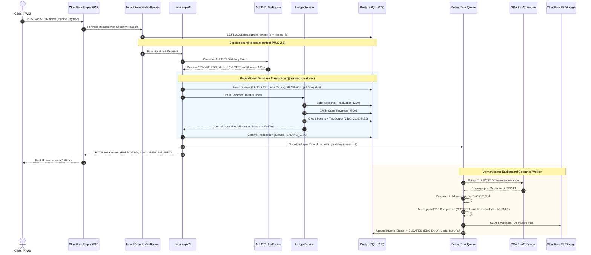
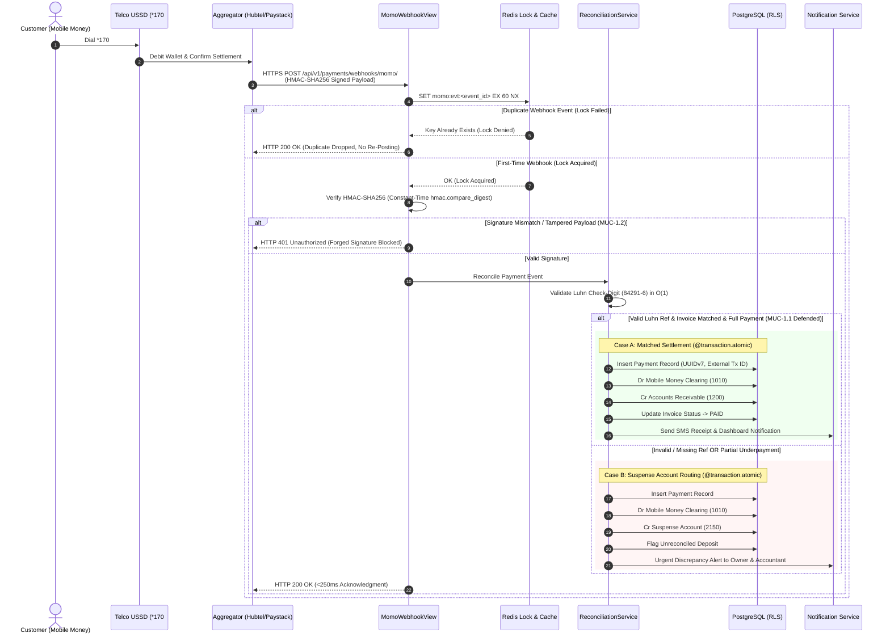
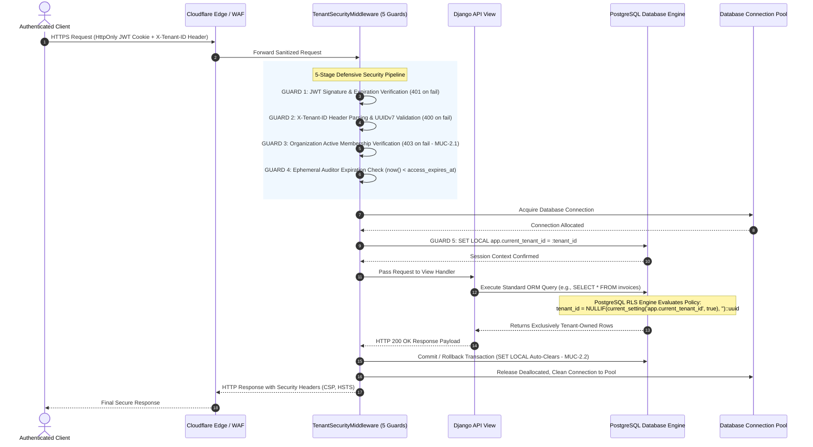
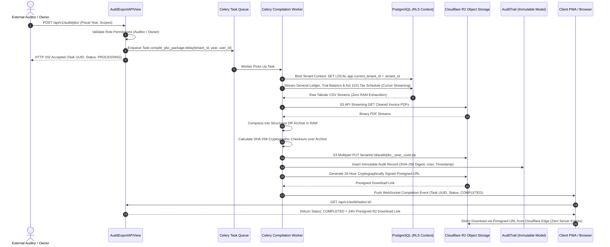
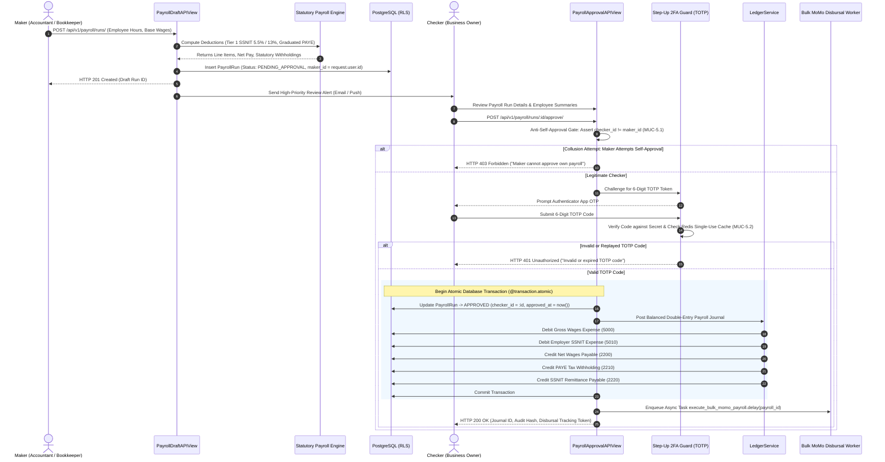

**MAGE BOOKS SAAS**

**Master Transaction Sequence Diagrams & Lifecycle Specification**

*A Formal Technical Specification of Financial State Machines, Statutory Tax Clearance,*  
*Mobile Money Idempotency, Session-Level Tenant Isolation, and Segregation of Duties*

**Author & Engineering Lead:** Marcel Yeboah  
**Project:** Mage Books SAAS (Ghana Enterprise Platform)  
**Version:** 2.0.0 (Production Sequence & Architecture Edition)  
**Statutory Standards:** Ghana Value Added Tax Act, 2025 (Act 1151\) / GRA E-VAT  
**Date:** September 2026

**Document Overview & Architectural Summary**

This specification provides the formal, end-to-end transactional interaction models for the Mage Books SAAS platform. In financial software engineering, static entity-relationship diagrams and class definitions are insufficient to guarantee accounting integrity; distributed edge gateways, asynchronous tax clearance authorities, and mobile network operators introduce race conditions, network partitions, and partial-write failures. This document details the exact sequence of messages, database transactions, state invariants, rollback procedures, and idempotency guarantees governing the five mission-critical lifecycles of Mage Books.

The lifecycles modeled in this specification enforce five non-negotiable architectural mandates:

1\. Act 1151 Ghanaian Statutory Tax Engine: Fully compliant with the Value Added Tax Act, 2025 (effective January 1, 2026), eliminating the repealed 1.0% COVID-19 Health Recovery Levy and applying non-cascading 15.0% Standard VAT, 2.5% NHIL, and 2.5% GETFund splits.

2\. Asynchronous External Decoupling: External third-party networks (Ghana Revenue Authority E-VAT servers, MTN/Telecel USSD rails, and Cloudflare R2 object storage) are decoupled from primary HTTP request-response cycles via Celery background task workers to ensure client response times remain under 150 milliseconds.

3\. Strict Multi-Tenant Isolation & Row-Level Security: Every database operation is bound to an isolated PostgreSQL session context via 'SET LOCAL app.current\_tenant\_id' executed through a five-stage security middleware pipeline.

4\. Distributed Webhook Idempotency & Suspense Routing: Telecommunication payment callbacks are deduplicated using distributed Redis atomic locks. Unmatched or erroneous deposits are safely quarantined into Suspense Account 2150 to preserve balance sheet integrity.

5\. Segregation of Duties & Cryptographic Step-Up Authentication: Strict maker-checker enforcement guarantees that no single user can draft and disburse payroll funds. High-value disbursements mandate Time-Based One-Time Password (TOTP) verification.

**1\. Sequence Diagram 1: Invoice Issuance, Act 1151 Tax Splits & Asynchronous GRA Clearance**

**1.1 Architectural Overview & Lifecycle Narrative**

The invoice issuance lifecycle captures the creation of a legally compliant B2B or B2C tax invoice in Ghana. When an authenticated user submits an invoice payload from the Next.js frontend, the request traverses the Cloudflare edge WAF and enters Django's TenantSecurityMiddleware. The middleware validates the JWT, verifies tenant membership, and establishes the PostgreSQL session-level tenant context.

Upon reaching the Invoicing API, the InvoicingService invokes the Act 1151 Statutory Tax Engine. The tax engine computes arbitrary-precision Decimal values for 15.0% Standard VAT, 2.5% NHIL, and 2.5% GETFund. The engine creates an immutable point-in-time snapshot of the customer's legal name, TIN/Ghana Card PIN, and physical address directly on the invoice record, insulating the transaction from subsequent customer profile mutations.

Within an atomic database transaction ('@transaction.atomic'), the invoice record is generated with a time-ordered UUIDv7 primary key and a Luhn check-digit reference (e.g., '84291-6'). The General Ledger Service posts balanced journal entries (debiting Accounts Receivable 1200 and crediting Sales Revenue 4000, VAT Output 2100, NHIL Output 2110, and GETFund Output 2120). Row-level locking on account balance records is strictly forbidden; balance sheet and trial balance figures are computed dynamically via optimized indexed queries.

Crucially, rather than executing a synchronous HTTP call to the Ghana Revenue Authority (GRA) E-VAT clearance endpoint—which would introduce latency and expose the user to external timeout failures—the invoice is committed locally in 'PENDING\_GRA' status. The API immediately returns HTTP 201 Created to the user in under 150ms. A background Celery worker subsequently executes the GRA clearance payload. Upon receiving the cryptographic signature and SDC ID from GRA, the worker generates the official E-VAT QR code in memory as an SVG, injects it into an air-gapped PDF, transmits the final document to Cloudflare R2, and transitions the invoice status to 'CLEARED'.

**1.2 Interaction Sequence Flowchart**

&nbsp;

**1.3 Step-by-Step Transaction Lifecycle Table**

| Step | Origin | Target | Protocol / Action | Operational Invariants & Error Handling |
| :---- | :---- | :---- | :---- | :---- |
| **1–2** | Client (PWA) | Middleware | HTTPS POST /api/v1/invoices/ | Cloudflare edge terminates TLS, evaluates WAF bot rules, and forwards payload. |
| **3–4** | Middleware | PostgreSQL | SQL (SET LOCAL) | Validates JWT; verifies active organization; executes 'SET LOCAL app.current\_tenant\_id' to bind DB session. |
| **5–6** | InvoicingAPI | TaxEngine | Internal Python Call | Computes statutory Act 1151 tax breakdown: 15% VAT, 2.5% NHIL, 2.5% GETFund. Uses arbitrary-precision Decimal. |
| **7–8** | InvoicingAPI | PostgreSQL | SQL INSERT (Atomic) | Generates UUIDv7 PK and Luhn check reference (e.g. 84291-6). Writes immutable customer legal snapshot. |
| **9–12** | InvoicingAPI | LedgerService | Internal Transaction | Dispatches journal entry: Dr Accounts Receivable (1200), Cr Sales Revenue (4000), Cr Tax Output (2100, 2110, 2120). |
| **13–14** | LedgerService | PostgreSQL | SQL COMMIT | Verifies sum(debit) \== sum(credit). Database commits invoice in 'PENDING\_GRA' state. Zero row locks on account balances. |
| **15** | InvoicingAPI | Celery Queue | AMQP / Redis Message | Enqueues 'clear\_with\_gra.delay(invoice\_id)' task with delivery confirmation. |
| **16–17** | InvoicingAPI | Client (PWA) | HTTP 201 Created | Returns complete invoice DTO with public share\_token (UUIDv4) and Luhn reference in \<150ms. |
| **18–19** | Celery Worker | GRA E-VAT | Mutual TLS / HTTPS POST | Sends payload to GRA. On network failure, retries via exponential backoff (1s, 2s, 4s, up to 10 attempts). |
| **20–22** | Celery Worker | Cloudflare R2 | In-Memory S3 API PUT | Generates vector QR SVG strictly in RAM. Injects into air-gapped PDF. Writes PDF to Cloudflare R2. |
| **23** | Celery Worker | PostgreSQL | SQL UPDATE | Updates invoice status to 'CLEARED' with GRA SDC ID, QR code payload, and S3 PDF link. Dispatches push notification. |

&nbsp;

**2\. Sequence Diagram 2: Mobile Money Webhook Reconciliation & Luhn Validation**

**2.1 Architectural Overview & Lifecycle Narrative**

Mobile Money (MTN MoMo, Telecel Cash, AT Money) represents over 85% of commercial transactions for Ghanaian small and medium enterprises. In Mage Books, customers pay invoices via USSD shortcodes (e.g., '\*170\#') or payment links by referencing the invoice's self-validating Luhn sequence code (e.g., '84291-6'). When the telco processes the payment, payment aggregators (Hubtel or Paystack) transmit an asynchronous HTTP webhook callback to Mage Books.

The WebhookReceiverView first subjects the incoming payload to cryptographic HMAC-SHA256 signature verification using the gateway's shared webhook secret. Requests with missing or invalid signatures are instantly rejected with HTTP 401 Unauthorized, thwarting spoofing attacks. To handle aggregator network retries and duplicate webhooks, the view implements distributed idempotency using Redis: it attempts an atomic 'SET key EX 60 NX' command keyed on 'momo:evt:\<event\_id\>'. If the key already exists, the event is identified as a duplicate and dismissed with an immediate HTTP 200 OK without re-executing accounting actions.

For verified first-time events, the ReconciliationService extracts the customer's payment reference. It strips non-digit characters and validates the Luhn check digit in O(1) mathematical time. If the reference is valid and matches an open invoice in 'POSTED' or 'PENDING\_PAYMENT' status, the service opens an atomic database transaction. It records a Payment record, posts a journal entry (debiting Mobile Money Clearing 1010 and crediting Accounts Receivable 1200), and transitions the invoice status to 'PAID'.

If the customer omitted the payment reference, entered a typographical error resulting in a failed Luhn check, or paid an amount mismatched with the open invoice, Mage Books refuses to drop the transaction. Instead, the funds are routed to Suspense Account 2150 (Unidentified MoMo Deposits), and a high-priority push notification and SMS are dispatched to the business owner and accountant to execute manual matching.

**2.2 Interaction Sequence Flowchart**

&nbsp;

**2.3 Step-by-Step Transaction Lifecycle Table**

| Step | Origin | Target | Protocol / Action | Operational Invariants & Error Handling |
| :---- | :---- | :---- | :---- | :---- |
| **1–2** | Customer | Gateway | Telco USSD / MoMo API | Customer enters reference (e.g., '84291-6'). Telco executes debit and notifies aggregator (Hubtel/Paystack). |
| **3** | Gateway | WebhookAPI | HTTPS POST Callback | Aggregator transmits webhook payload containing transaction ID, external reference, amount, and HMAC-SHA256 signature. |
| **4–5** | WebhookAPI | Redis | Redis SET NX EX 60 | Acquires distributed lock for event ID. If lock fails (duplicate event), returns HTTP 200 OK immediately to halt duplicate processing. |
| **6** | WebhookAPI | WebhookAPI | Cryptographic HMAC Verify | Computes HMAC-SHA256 over raw request body using tenant webhook secret. Rejects mismatched signatures with HTTP 401\. |
| **7–8** | WebhookAPI | Reconciler | Internal Service Call | Extracts reference string and validates Luhn check-digit in O(1) time. Determines whether reference matches an open invoice. |
| **9–14** | Reconciler | PostgreSQL | SQL (Case A: Match) | Within @transaction.atomic: Inserts Payment row; posts balanced journal (Dr 1010 MoMo Cash, Cr 1200 AR); marks invoice PAID. |
| **15** | Reconciler | Notification | Async Message / SMS | Dispatches SMS confirmation to customer and real-time WebSocket notification to merchant dashboard. |
| **16–20** | Reconciler | PostgreSQL | SQL (Case B: Suspense) | If reference is unresolvable or corrupted: Inserts Payment row; posts Dr 1010 MoMo Cash, Cr 2150 Suspense Account. Never loses money. |
| **21** | Reconciler | Notification | Urgent Alert (Email/SMS) | Notifies business owner and external accountant with unmatched deposit details for manual one-click reconciliation. |
| **22–23** | WebhookAPI | Gateway | HTTP 200 OK | Returns HTTP 200 acknowledgment to aggregator within 250ms, satisfying webhook SLAs and stopping gateway retries. |

&nbsp;

**3\. Sequence Diagram 3: Multi-Tenant Security Middleware & PostgreSQL RLS Enforcement**

**3.1 Architectural Overview & Lifecycle Narrative**

Mage Books implements a pooled database multi-tenant architecture where hundreds of Ghanaian businesses share the same PostgreSQL database cluster. To guarantee absolute, tamper-proof data segregation, tenant isolation is not entrusted to application-level ORM filters (e.g., 'Company.objects.filter(tenant=...)'), which are vulnerable to developer oversight. Instead, isolation is enforced at the database engine level via PostgreSQL Row-Level Security (RLS) managed by a five-stage middleware pipeline: TenantSecurityMiddleware.

When an HTTP request arrives, Stage 1 extracts and cryptographically validates the HttpOnly JWT access cookie. Stage 2 parses the mandatory 'X-Tenant-ID' request header. Stage 3 queries the tenant membership table to confirm that the authenticated user possesses an active, non-suspended membership in the specified organization. If the user is an external Chartered Accountant, Stage 4 verifies whether their access window has expired (checking that current\_time \< access\_expires\_at).

In Stage 5, the middleware intercepts the active database connection and executes 'SET LOCAL app.current\_tenant\_id \= :tenant\_id'. The 'SET LOCAL' construct is critical: it scopes the configuration variable strictly to the lifespan of the current database transaction. When the transaction finishes and the connection returns to the connection pool (PgBouncer/Django connection pooler), the session variable is automatically deallocated, preventing tenant context leaks into subsequent requests.

When the Django ORM executes any subsequent SQL query (e.g., 'SELECT \* FROM invoices'), PostgreSQL's internal RLS engine automatically evaluates the tenant policy ('tenant\_id \= NULLIF(current\_setting(\\'app.current\_tenant\_id\\', true), \\'\\')::uuid'). If an attacker tampers with parameters or attempts cross-tenant SQL injection, PostgreSQL returns zero records, maintaining absolute tenancy guarantees.

**3.2 Interaction Sequence Flowchart**

&nbsp;

**3.3 Step-by-Step Transaction Lifecycle Table**

| Step | Origin | Target | Protocol / Action | Operational Invariants & Error Handling |
| :---- | :---- | :---- | :---- | :---- |
| **1–2** | Client | Middleware | HTTPS Request | Sends request with HttpOnly JWT cookie and 'X-Tenant-ID' header. Edge validates TLS and passes to Django. |
| **3** | Middleware | Middleware | Guard 1: JWT Verification | Validates JWT cryptographic signature against server secret; verifies token has not expired. Rejects with HTTP 401 on failure. |
| **4** | Middleware | Middleware | Guard 2: Header Parsing | Extracts 'X-Tenant-ID'; validates UUID format. Returns HTTP 400 Bad Request if header is missing or malformed. |
| **5** | Middleware | Middleware | Guard 3: Membership Check | Resolves user's TenantMembership record for target tenant. Verifies status \== 'ACTIVE'. Returns HTTP 403 Forbidden if not member. |
| **6** | Middleware | Middleware | Guard 4: Auditor Expiry | If user role is 'AUDITOR', evaluates 'now() \< access\_expires\_at'. Rejects expired auditor sessions with HTTP 403 Forbidden. |
| **7–10** | Middleware | PostgreSQL | Guard 5: Session Binding | Acquires connection and executes 'SET LOCAL app.current\_tenant\_id \= :tenant\_id'. Scoped strictly to current transaction. |
| **11–12** | Middleware | Django View | Pipeline Execution | Passes sanitized request to application controller. View executes standard ORM operations without manual tenant filtering. |
| **13–14** | Django View | PostgreSQL Engine | SQL Execution & RLS Filter | PostgreSQL automatically enforces RLS policy, filtering all tables by tenant\_id. Returns strictly tenant-owned records. |
| **15–17** | Middleware | DB Pool | Session Deallocation | Transaction commits or rolls back; 'SET LOCAL' variable automatically clears. Clean connection is safely returned to pool. |
| **18** | Middleware | Client | HTTPS Response | Transmits HTTP response payload to client with security headers (CSP, HSTS, X-Frame-Options: DENY). |

&nbsp;

**4\. Sequence Diagram 4: Statutory External Audit PBC Package Generation & Presigned Cloudflare R2 Export**

**4.1 Architectural Overview & Lifecycle Narrative**

Under Ghanaian corporate law and GRA auditing guidelines, enterprises must furnish external auditors with a comprehensive Provided By Client (PBC) audit package. Generating multi-year general ledgers, trial balances, statutory tax returns, and supporting invoice PDFs for thousands of transactions constitutes an intensive I/O and compute workload. Executing this synchronously within a web worker would result in gateway timeouts (e.g., Cloudflare 524 HTTP timeouts) and server memory exhaustion.

The Audit Export lifecycle delegates this entire compilation to an asynchronous background worker. When an authorized user (Business Owner or External Auditor) triggers an export via the AuditExportAPIView, the endpoint validates permissions and immediately enqueues a Celery task: 'compile\_pbc\_package.delay(tenant\_id, fiscal\_year, requested\_by)'. The API instantly returns HTTP 202 Accepted with a task tracking ID and initial status 'PROCESSING'.

The Celery worker initializes an isolated PostgreSQL connection with the tenant's RLS context. It streams the Trial Balance, General Ledger journal lines, and Act 1151 Tax Returns directly into CSV formats. Concurrently, it retrieves cleared invoice PDF documents from Cloudflare R2. These assets are compiled in-memory into a single structured ZIP archive. To guarantee legal non-repudiation, the worker computes the SHA-256 cryptographic hash of the compiled ZIP file and records the digest in the immutable AuditTrail model.

The completed ZIP package is uploaded to Cloudflare R2 under an unguessable UUIDv4 key path. The worker generates an authenticated, time-limited presigned URL expiring in exactly 24 hours. When the client polls the status endpoint or receives the completion WebSocket message, it retrieves the presigned link, allowing the auditor to download the verified package directly from Cloudflare's global edge network without consuming application server bandwidth.

**4.2 Interaction Sequence Flowchart**

&nbsp;

**4.3 Step-by-Step Transaction Lifecycle Table**

| Step | Origin | Target | Protocol / Action | Operational Invariants & Error Handling |
| :---- | :---- | :---- | :---- | :---- |
| **1–2** | Auditor / Owner | AuditAPI | HTTPS POST /api/v1/audit/pbc/ | Validates user role (Owner or Auditor). Verifies target fiscal year is closed or locked for audit review. |
| **3–4** | AuditAPI | Celery Queue | AMQP Enqueue & HTTP 202 | Dispatches 'compile\_pbc\_package.delay()' with tenant parameters. Returns HTTP 202 Accepted with task UUID in \<100ms. |
| **5–6** | Celery Queue | Celery Worker | Task Worker Pickup | Worker starts execution; establishes PostgreSQL connection; executes 'SET LOCAL app.current\_tenant\_id \= :tenant\_id'. |
| **7–8** | Celery Worker | PostgreSQL | SQL Cursor Streaming | Streams General Ledger (CSV), Trial Balance (CSV), and Act 1151 Tax Schedule without loading all rows into RAM. |
| **9–10** | Celery Worker | Cloudflare R2 | S3 API Streaming GET | Fetches associated cleared invoice PDFs from Cloudflare R2 bucket using asynchronous I/O. |
| **11–12** | Celery Worker | Celery Worker | In-Memory ZIP & Hash | Compresses CSVs and PDFs into structured ZIP archive. Computes SHA-256 cryptographic digest over final archive. |
| **13** | Celery Worker | Cloudflare R2 | S3 API Multipart PUT | Uploads final ZIP package to private R2 storage at 'tenants/\<id\>/audit/pbc\_\<year\>\_\<uuidv4\>.zip'. |
| **14** | Celery Worker | AuditLog | SQL INSERT (Tamper-Proof) | Writes immutable entry into AuditTrail model storing package filename, SHA-256 hash, requesting user, and timestamp. |
| **15–16** | Celery Worker | Cloudflare R2 | S3 Client Presign | Generates secure presigned download URL configured with a strict 24-hour expiration window. |
| **17–20** | Celery Worker | Client (PWA) | WebSocket Push / Direct GET | Notifies client. Auditor clicks link and streams verified PBC package directly from Cloudflare edge with zero server egress. |

&nbsp;

**5\. Sequence Diagram 5: Segregation of Duties — Payroll Maker-Checker Workflow & Step-Up 2FA Authorization**

**5.1 Architectural Overview & Lifecycle Narrative**

In corporate accounting, payroll disbursement represents the greatest vulnerability for internal fraud, ghost worker allocation, and embezzlement. Mage Books enforces a strict Segregation of Duties (Maker-Checker Architecture) supported by cryptographic Step-Up Two-Factor Authentication (TOTP). No single user—regardless of organizational hierarchy—is permitted to both initiate and authorize a financial disbursement.

The lifecycle begins when a Maker (typically the company's Bookkeeper or Accountant) drafts a monthly payroll run via the PayrollDraftAPIView. The backend invokes the Statutory Payroll Calculation Engine to compute gross wages, employee Tier 1 SSNIT (5.5%), employer Tier 1 SSNIT (13.0%), and graduated Ghanaian Pay-As-You-Earn (PAYE) income tax withholdings. The payroll run is stored in PostgreSQL with status 'PENDING\_APPROVAL', recording the maker's user ID ('maker\_id').

When the Checker (Business Owner or Managing Director) logs in to review the payroll, the system performs an anti-self-approval validation: if 'request.user.id \== payroll.maker\_id', approval is blocked with HTTP 403 Forbidden. The checker inspects employee line items, net pay totals, and statutory remittance schedules.

Upon clicking Approve, the frontend prompts for a 6-digit Time-Based One-Time Password (TOTP) from the checker's authenticator app. The ApprovalAPIView verifies the TOTP code against the checker's enrolled secret. Only upon successful cryptographic verification does the system initiate an atomic database transaction: it updates the payroll status to 'APPROVED', transitions line items, and instructs the LedgerService to post the balanced double-entry payroll entry (debiting Gross Wages Expense 5000 and Employer SSNIT Expense 5010; crediting Net Wages Payable 2200, PAYE Tax Payable 2210, and SSNIT Payable 2220). An asynchronous Celery task is then dispatched to initiate bulk Mobile Money disbursements to employees.

**5.2 Interaction Sequence Flowchart**

&nbsp;

**5.3 Step-by-Step Transaction Lifecycle Table**

| Step | Origin | Target | Protocol / Action | Operational Invariants & Error Handling |
| :---- | :---- | :---- | :---- | :---- |
| **1–3** | Maker (Accountant) | TaxEngine | Internal Computation | Calculates statutory deductions: 5.5% employee SSNIT, 13.0% employer SSNIT, and graduated Ghanaian PAYE tax brackets. |
| **4–5** | PayrollAPI | PostgreSQL | SQL INSERT | Creates PayrollRun with 'maker\_id \= request.user.id' and status 'PENDING\_APPROVAL'. Returns HTTP 201 Created to maker. |
| **6–7** | System | Checker (Owner) | Notification & Review | Alerts Business Owner. Owner opens payroll review screen, verifying employee hours, wages, deductions, and net payouts. |
| **8** | ApprovalAPI | ApprovalAPI | Anti-Self-Approval Gate | Verifies 'request.user.id \!= payroll.maker\_id'. If maker attempts self-approval, rejects immediately with HTTP 403 Forbidden. |
| **9–13** | Checker | 2FA Guard | TOTP Challenge | Demands 6-digit TOTP code. Validates time-drift tolerance (+/- 1 step). Rejects invalid codes with HTTP 401 Unauthorized. |
| **14–15** | ApprovalAPI | PostgreSQL | SQL (Atomic Update) | Begins @transaction.atomic; updates payroll run status to 'APPROVED'; records 'checker\_id' and 'approved\_at' timestamp. |
| **16–17** | ApprovalAPI | LedgerService | Double-Entry Posting | Posts balanced entry: Dr Wages Expense (5000) & Employer SSNIT (5010); Cr Net Pay Payable (2200), PAYE (2210), SSNIT (2220). |
| **18** | ApprovalAPI | Disbursal Worker | AMQP Celery Dispatch | Enqueues 'execute\_bulk\_momo\_payroll.delay(payroll\_id)' for direct Mobile Money disbursements to employee SIM wallets. |
| **19** | ApprovalAPI | Checker | HTTP 200 OK | Returns execution confirmation with journal entry ID, audit hash, and batch disbursal tracking token. |

&nbsp;

**6\. Resilience, Integrity & Recovery Matrix**

To ensure 99.99% operational availability and prevent financial ledger corruption during network disruptions, hardware failures, or external API outages, Mage Books implements comprehensive circuit breakers, dead-letter queues, and automated reconciliation policies:

| Failure Scenario | Affected Lifecycle | System Behavior & Failure Containment | Recovery & Self-Healing Mechanism |
| :---- | :---- | :---- | :---- |
| **GRA E-VAT Outage** | Invoice Issuance | Invoice committed locally as 'PENDING\_GRA'. Client gets HTTP 201 in \<150ms with valid Luhn payment reference. | Celery worker retries via exponential backoff (up to 10 attempts). Circuit breaker activates if failure rate \>30% over 5m. |
| **Duplicate MoMo Webhook** | MoMo Settlement | Redis atomic mutex ('SET key EX 60 NX') catches duplicate event within 60s. | Returns HTTP 200 OK immediately without double-posting to the general ledger or triggering duplicate SMS receipts. |
| **Unmatched MoMo USSD Deposit** | MoMo Settlement | Customer omitted reference or failed Luhn check. Transaction cannot be matched to open invoice. | Funds automatically credit Suspense Account 2150\. Owner and accountant receive real-time alert for 1-click manual match. |
| **Auditor Privilege Escalation** | Multi-Tenant RLS | Auditor attempts write operation (POST/PUT/DELETE) or accesses unauthorized tenant. | TenantSecurityMiddleware blocks write calls with HTTP 403\. PostgreSQL RLS strictly restricts data to auditor's tenant. |
| **Ghost Worker / Collusion** | Payroll Disbursal | Maker attempts to approve their own payroll draft or bypass statutory deductions. | Anti-self-approval gate enforces maker\_id \!= checker\_id. High-value disbursements strictly mandate TOTP 2FA verification. |

&nbsp;

This formal specification governs all API implementations, Celery worker routines, and database migration constraints across Sprints 1 through 5 of the Mage Books engineering roadmap.